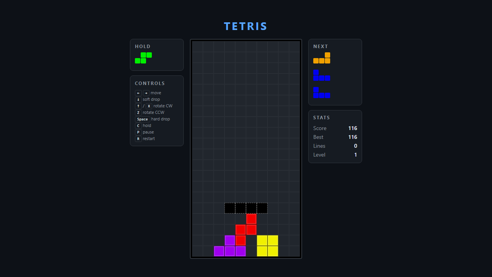

# Tetris

A faithful Tetris implementation built from scratch in React + TypeScript, following the official Tetris Guideline (SRS rotation with wall kicks, 7-bag randomizer, official scoring, gravity formula, T-spin detection).



## Features

- 10×20 playing field with the 7 standard tetrominos and their canonical colors
- Super Rotation System (SRS) with full wall- and floor-kick tables for I and J/L/S/T/Z
- 7-bag (random bag) piece generation
- Hard drop, soft drop, ghost piece, hold (1 swap per piece)
- Next-piece queue (3 visible)
- Tetris Guideline scoring: single / double / triple / tetris, T-spin (mini and full), back-to-back bonus, combo bonus, soft- and hard-drop points
- Level-based gravity using the Guideline formula `time = (0.8 - (level - 1) * 0.007)^(level - 1)`
- Lock delay with reset cap, top-out and lock-out detection
- Pause, restart, persistent best score (localStorage)
- Configurable DAS/ARR (170ms / 50ms)
- Fully responsive layout

## Controls

| Key                         | Action          |
| --------------------------- | --------------- |
| `←` `→`                     | Move            |
| `↓`                         | Soft drop       |
| `↑` or `X`                  | Rotate CW       |
| `Z` or `Ctrl`               | Rotate CCW      |
| `Space`                     | Hard drop       |
| `C` or `Shift`              | Hold            |
| `P` or `Esc`                | Pause / Resume  |
| `R`                         | Restart         |
| `Enter`                     | Start / Resume  |

## Architecture

The codebase separates the **pure game logic** (`src/logic/`) from the **React UI** (`src/ui/`). Logic modules export plain functions and a reducer with no React or DOM dependencies, which makes the game rules trivially testable.

```
src/
├── logic/                # framework-free game core (covered ≥85%)
│   ├── types.ts          # board / piece types and constants
│   ├── pieces.ts         # tetromino shapes for all rotations
│   ├── board.ts          # board ops: place, lock, clear, ghost, drop
│   ├── srs.ts            # SRS rotation + kick tables
│   ├── rng.ts            # mulberry32 PRNG and 7-bag randomizer
│   ├── scoring.ts        # scoring, level, gravity, T-spin detection
│   └── game.ts           # reducer, state, actions
└── ui/
    ├── App.tsx           # top-level component
    ├── Board.tsx         # cell grid renderer
    ├── PiecePreview.tsx  # mini renderer used for Hold and Next
    ├── useGameLoop.ts    # rAF-based ticker
    ├── useKeyboard.ts    # input handler with DAS/ARR auto-repeat
    └── styles.css
```

## Local development

```bash
npm install
npm run dev          # http://localhost:5173
```

### Quality gates

```bash
npm run lint         # ESLint
npm run typecheck    # tsc --noEmit
npm test             # Vitest watch mode
npm run test:coverage  # Vitest with v8/istanbul coverage report
npm run build        # Type-check + Vite production build
npm run e2e          # Playwright end-to-end tests (builds + serves)
```

## Coverage

The pure logic in `src/logic/` is held to a **≥85%** coverage threshold (lines, functions, statements, branches), enforced by the test runner (`npm run test:coverage`).

## Continuous Integration

Every push and PR runs lint, type-check, unit tests with coverage, production build, and the Playwright suite via GitHub Actions (`.github/workflows/ci.yml`).

## License

MIT
